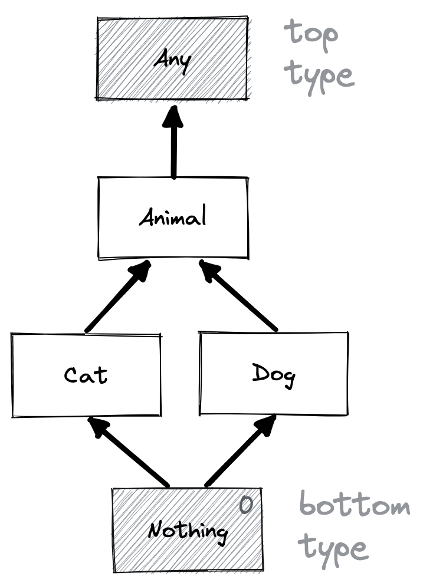
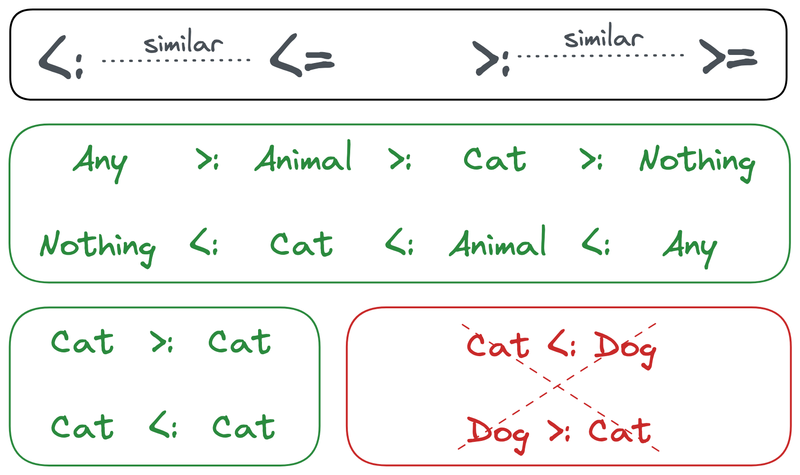
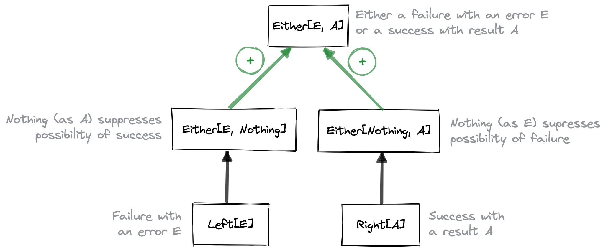

autoscale: true
footer: Practical Functional Programming - Handling Errors
slidenumbers: true

# Practical Functional Programming

# [fit] **Handling Errors**

## in Scala

---

# Previously, **Immutability**

---

# Immutable Class

```scala
case class Customer(id: Int, firstName: String, lastName: String)

// Create an new instance
val customer = Customer(id = 1, firstName = "John", lastName = "Doe")
val name = customer.firstName

// Create a modified copy of an instance
val modifiedCustomer = customer.copy(lastName = "Martin")
// `customer` remains unmodified

// Compare instances by value
val sameCustomer = Customer(id = 1, firstName = "John", lastName = "Doe")
assert(customer == sameCustomer)
```

---

# Immutable Collection

```scala
// Create a new instance
val greetings: Set[String] = Set("hello", "goodbye")

// Creating an instance by applying a method on an instance  
val availableGreetings =
  greetings ++ Set("hi", "bye", "hello")
// `greetings` remains unmodified
```

---

# Expressions

```scala
val status = if enabled then "On" else "Off" // `if` expression

val mark = color match { // `match` expression
  case Red => 2
  case Orange => 4
  case Green => 6
}

val altitude = { // { ... } expression
  val y = slope * t

  if y < -threshold then -threshold
  else if y > threshold then threshold
  else y
}
```

---

# Simple Immutable `enum`

```scala
enum Direction {
  case North, South, West, East
}

case class Position(x: Int, y: Int) {
  def move(direction: Direction): Position =
    direction match {
      case North => this.copy(y = this.y - 1)
      case South => this.copy(y = this.y + 1)
      case West => this.copy(x = this.x - 1)
      case East => this.copy(x = this.x + 1)
    }
}
```

---

# Immutable `enum` on Steroids

```scala
enum Action { // ADT (Algebraic Data Type)
  case Sleep
  case Walk(direction: Direction)
  case Jump(position: Position)
}

case class Player(position: Position) {
  def act(action: Action): Player =
    action match { // Pattern Matching
      case Sleep => this
      case Walk(direction) => Player(position.move(direction))
      case Jump(position) => Player(position)
    }
}
```

---

# Subtyping
## Beyond Inheritance

---




---



---

# Result or First Error, `Either`

---

# Either an Error or a Result

```scala
enum Either[+E, +A] { // ...
  case Left[E](error: E) extends Either[E, Nothing]
  case Right[A](result: A) extends Either[Nothing, A]
  // ...
}

object Either {
  def succeed[A](result: A): Either[Nothing, A] = Right(result)
  def fail[E](error: E): Either[E, Nothing] = Left(error)
  // ...
}
```

---



---

# Chaining After a Result

```scala
enum Either[+E, +A] { // ...
  // Could be named `thenChain`
  def flatMap[E2 >: E, B](
                           cont: A => Either[E2, B]
                         ): Either[E2, B] = ???
  
  // OUTPUT result type is `B`.
  
  // OUTPUT error type (`E2`) should be a supertype of both INPUT error types,
  // i.e. `E` and the actual error type in `cont`
  // ...
}
```

---

# Finding a :cat: and a Compatible :dog:

```scala
enum Error {
  case CatNotFound(id: Int)
  case CompatibleDogNotFound(cat: Cat)
}

def findCat(id: Int): Either[CatNotFound, Cat] = ???
def findCompatibleDog(cat: Cat): Either[CompatibleDogNotFound, Dog] = ???

val errorOrDog: Either[Error, Dog] =
  findCat(1).flatMap(cat => findCompatibleDog(cat))
```

---

# Implementing `flatMap`

```scala
enum Either[+E, +A] { va => // `va` becomes an alias for `this`
  def flatMap[E2 >: E, B](cont: A => Either[E2, B]): Either[E2, B] =
    va match {
      case Right(a) => cont(a)
      case Left(e) => Left(e)
    }
  // ...
}
```

---

# Transforming Result

```scala
enum Either[+E, +A] { va => // ...
  // Could be named `thenTransform`
  def map[B](trans: A => B): Either[E, B] =
    va match {
      case Right(a) => Right(trans(a))
      case Left(e) => Left(e)
    }
  // ...
}
```

---

# Savings Account

```scala
case class SavingsAccount(balance: Int) {
  def debit(amount: Int): Either[String, SavingsAccount] =
    if this.balance - amount >= 0 then
      Either.succeed(SavingsAccount(balance = this.balance - amount))
    else
      Either.fail("Cannot be over-debited")

  def credit(amount: Int): Either[String, SavingsAccount] =
    if this.balance + amount <= 500 then
      Either.succeed(SavingsAccount(balance = this.balance + amount))
    else
      Either.fail("Cannot be over-credited")
}
```

---

# Transferring Money

```scala
object SavingsAccount {
  def transfer(
                source: SavingsAccount,
                destination: SavingsAccount,
                amount: Int
              ): Either[String, (SavingsAccount, SavingsAccount)] =

    source.debit(amount) /* */ .flatMap { updatedSource =>
      destination.credit(amount) /* */ .map { updatedDestination =>
        (updatedSource, updatedDestination)
      }
    }
}
```

---

# Flatten Those `map`s and `flatMap`s!

```scala

object SavingsAccount {
  def transfer(
                source: SavingsAccount,
                destination: SavingsAccount,
                amount: Int
              ): Either[String, (SavingsAccount, SavingsAccount)] =

    for {
      updatedSource <- source.debit(amount)
      updatedDestination <- destination.credit(amount)
    } yield (updatedSource, updatedDestination)
}
```

---

#  Successfull Transfer

```scala
val success = SavingsAccount.transfer(
  source = SavingsAccount(200),
  destination = SavingsAccount(300),
  amount = 50
)

assert(success == Right((SavingsAccount(150), SavingsAccount(350))))
```

---

# Failed Transfers

```scala

val overDebited = SavingsAccount.transfer(
  source = SavingsAccount(40),
  destination = SavingsAccount(300),
  amount = 50
)

assert(overDebited == Left("Cannot be over-debited"))

val overCredited = SavingsAccount.transfer(
  source = SavingsAccount(200),
  destination = SavingsAccount(400),
  amount = 150
)

assert(overCredited == Left("Cannot be over-credited"))
```

---

# Transforming Error

```scala
enum Either[+E, +A] { va => // ...
  def mapError[E2](trans: E => E2): Either[E2, A] =
    va match {
      case Right(a) => Right(a)
      case Left(e) => Left(trans(e))
    }
  // ...
}
```

---

# Parsing an Integer

```scala
object IntField {
  def parse(s: String): Either[String, Int] =
    if s.nonEmpty && s.forall(c => c.isDigit) then
      Either.succeed(s.toInt)
    else
      Either.fail(s"Invalid integer ($s)")
}
```

---

# Parsing a Point

```scala
case class Point(x: Int, y: Int)
case class PointForm(x: String, y: String)

object PointForm {
  def parse(form: PointForm): Either[String, Point] =
    for {
      x <- IntField.parse(form.x).mapError(e => s"x: $e")
      y <- IntField.parse(form.y).mapError(e => s"y: $e")
    } yield Point(x, y)
}
```

---

# First Error Only

```scala
val success: Either[String, Point] = PointForm.parse(PointForm(x = "1", y = "2"))
assert(success == Right(Point(1,2)))

val xFailure: Either[String, Point] = PointForm.parse(PointForm(x = "XXX", y = "2"))
assert(xFailure == Left("x: Invalid integer (XXX)"))

val yFailure: Either[String, Point] = PointForm.parse(PointForm(x = "1", y = "YYY"))
assert(yFailure == Left("y: Invalid integer (YYY))"))

val xAndYFailure: Either[String, Point] = PointForm.parse(PointForm(x = "XXX", y = "YYY"))
assert(xAndYFailure == Left("x: Invalid integer (XXX)"))
// Just the first error. What about the second error?
```

---

# This Is the Nature of `flatMap`

```scala
enum Either[+E, +A] { va => // ...
  def flatMap[E2 >: E, B](cont: A => Either[E2, B]): Either[E2, B] = ??? // ...
}
```

* `flatMap` fundamentally **cannot report multiple errors**.
  - Let's assume `va` is a **failure**, we just have an `E`.
  - There's no available `A`, so we cannot call `cont`.
  - There's no way to know whether `cont` would return another **failure**.
* `flatMap` is inherently **sequentially dependent**
  - We have to know about _success_ or _failure_ for `va` **before** we can call `cont`.

---

# A Mental Model for Errors

---

# Success, Failure and Death

* **Succeed** with a **result**

* **Fail** with an **error**
  - _Expected_, recoverable
  - **Domain** error, **business** error, but not only
  - Materialized as a value (`Either.Left[E]`, `Validation.Failure[E]`)

* **Die** with a **defect**
  - _Unexpected_, not recoverable
  - Materialized as an **Exception**

---

# Turning Exception to Error

```scala
object Either { // ...
  def attempt[A](result: => A): Either[Throwable, A] =
    // `=> A` is equivalent to `() => A`
    // But `attempt` should be called with `Either.attempt(<expr>)`

    try succeed(result) // `result` is used here, <expr> is evaluated here
    catch {
      case defect: Throwable => fail(defect)
    }
  // ...
}
```

---

# Refining Errors

```scala
object Either { // ...
  // Provide `refineToOrDie` method to `Either` instances
  extension [E <: Throwable, A](either: Either[E, A]) {
    def refineToOrDie[E2 <: E /* ... */]: Either[E2, A] = ???
  }
}
```

* `refineToOrDie` is only available when `E` is a subtype of `Throwable`
* **Refine** error type from `E` to subtype `E2`
  - From `Either[E, A]` to `Either[E2, A]`
* **Rethrow** any other previously captured exception when not subtype of `E2`

---

# Parsing an Integer (Handling Exception)

```scala
object IntField {
  def parse(s: String): Either[String, Int] =
    Either.attempt(/* () => */ s.toInt) /* Either[Throwable, Int] */
      .refineToOrDie[NumberFormatException] /* Either[NumberFormatException, Int] */
            // Would rethrow captured `NullPointerException`
      .mapError(_ => s"Invalid integer ($s)")
}
```

---

# Result or Errors, `Validation`

---

# Multiple Errors

```scala
enum Validation[+E, +A] { // ...
  case Failure[E](errors: Seq[E]) extends Validation[E, Nothing]
  case Success[A](result: A) extends Validation[Nothing, A]
  //...
}

object Validation {
  def succeed[A](result: A): Validation[Nothing, A] = Success(result)
  def fail[E](error: E): Validation[E, Nothing] = Failure(Seq(error))
  // ...
}
```

---

# Merge Validations

```scala
enum Validation[+E, +A] { va => // ...
  def zipPar[E2 >: E, B](vb: Validation[E2, B]): Validation[E2, (A, B)] =
    (va, vb) match {
      case (Success(a), Success(b)) => Success((a, b))
      case (Failure(e1), Success(_)) => Failure(e1)
      case (Success(_), Failure(e2)) => Failure(e2)
      case (Failure(e1), Failure(e2)) => Failure(e1 ++ e2)
    }
  // ...
}
```

---

# Merge Operator

```scala
enum Validation[+E, +A] { va => // ...
  def <&>[E2 >: E, B](vb: Validation[E2, B]): Validation[E2, (A, B)] =
    va.zipPar(vb)
  // ...
}
```

---

# Transforming Result

```scala
enum Validation[+E, +A] { va => // ...
  def map[B](trans: A => B): Validation[E, B] =
    va match {
      case Success(a) => Success(trans(a))
      case Failure(e) => Failure(e)
    }
  // ...
}
```

---

# Savings Account Revisited

```scala
case class SavingsAccount(balance: Int) {
  def debit(amount: Int): Validation[String, SavingsAccount] =
    if this.balance - amount >= 0 then 
      Validation.succeed(SavingsAccount(balance = this.balance - amount))
    else
      Validation.fail("Cannot be over-debited")

  def credit(amount: Int): Validation[String, SavingsAccount] =
    if this.balance + amount <= 500 then
      Validation.succeed(SavingsAccount(balance = this.balance + amount))
    else
      Validation.fail("Cannot be over-credited")
}
```

---

# Transferring Money Revisited

```scala
case class TransferResult(updatedSource: SavingsAccount, updatedDestination: SavingsAccount)

object SavingsAccount {
  def transfer(source: SavingsAccount, destination: SavingsAccount, amount: Int): Validation[String, TransferResult] = {
    val updatedSource = source.debit(amount)
    val updatedDestination = destination.credit(amount)
    
    val updatedAccounts: Validation[String, (SavingsAccount, SavingsAccount)] =
      updatedSource <&> updatedDestination

    val transferResult: Validation[String, TransferResult] =
      updatedAccounts.map((updatedSource, updatedDestination) => TransferResult(updatedSource, updatedDestination))

    transferResult
  }
}
```

---

# Transforming Errors

```scala
enum Validation[+E, +A] { va => // ...
  def mapError[E2](trans: E => E2): Validation[E2, A] = 
    va match {
      case Success(a) => Success(a)
      case Failure(e /* : Seq[E] */) => Failure(e.map(trans))
    }
  // ...
}
```

---

# Either to Validation

```scala
enum Either[+E, +A] { va => // ...
  def toValidation: Validation[E, A] =
    va match {
      case Right(a) => Validation.succeed(a)
      case Left(e) => Validation.fail(e)
    }
  // ...
}
```

---

# Parsing a Point

```scala
case class Point(x: Int, y: Int)
case class PointForm(x: String, y: String)

object PointForm {
  def parse(form: PointForm): Validation[String, Point] =
    (
      IntField.parse(form.x).toValidation.mapError(e => s"x: $e") <&>
      IntField.parse(form.y).toValidation.mapError(e => s"y: $e")
    ).map((x, y) => Point(x, y))
}
```

---

# Keeps All Errors

```scala
val success = PointForm.parse(PointForm(x = "1", y = "2"))
assert(success == Success(Point(1, 2)))

val xFailure = PointForm.parse(PointForm(x = "XXX", y = "2"))
assert(xFailure == Failure(Seq("x: Invalid integer (XXX)")))

val xAndYFailure = PointForm.parse(PointForm(x = "XXX", y = "YYY"))

assert(xAndYFailure ==
  Failure(
    Seq(
      "x: Invalid integer (XXX)",
      "y: Invalid integer (YYY)"
    )
  )
)
```

---

# Parsing a Rectangle

```scala
case class Rectangle(p1: Point, p2: Point)
case class RectangleForm(p1: PointForm, p2: PointForm)

object RectangleForm {
  def parse(form: RectangleForm): Validation[String, Rectangle] =
    (
      PointForm.parse(form.p1).mapError(e => s"p1.$e") <&>
      PointForm.parse(form.p2).mapError(e => s"p2.$e")
    ).map((p1, p2) => Rectangle(p1, p2))
}
```

---

# Really Keeps All Errors

```scala
val rectangleForm = RectangleForm(
  p1 = PointForm(x = "P1X", y= "2"),
  p2 = PointForm(x = "3", y= "P2Y")
)

val failure = RectangleForm.parse(rectangleForm)

assert(failure ==
  Failure(
    Seq(
      "p1.x: Invalid integer (P1X)",
      "p2.y: Invalid integer (P2Y)"
    )
  )
)
```

---

# In  A Nutshell

---

# Handling Errors in Pure Functions

* **Pure** methods (and functions) do not perform any kind of I/O, parallelism or concurrency
* Report success with a **result**, or failure with an **error**, with a dedicated `enum` (with type parameters :wink:)
  - Report **first error**, `Either[E, A]`
  - Report **accumulated errors**, `Validation[E, A]`
* Report failure with an **error** (recoverable) as a special `case` of the `enum`
* Report death with a **defect** (unrecoverable) as an exception

---

# In Real Life

* Exactly the same... but not with our toys!
* `Either` from **Scala standard library**
  - Maybe with some extension methods to fix the legacy a bit
* `Validation` from **ZIO Prelude** library
  - Also supports **warnings** (possibly together with result) with `ZValidation`
