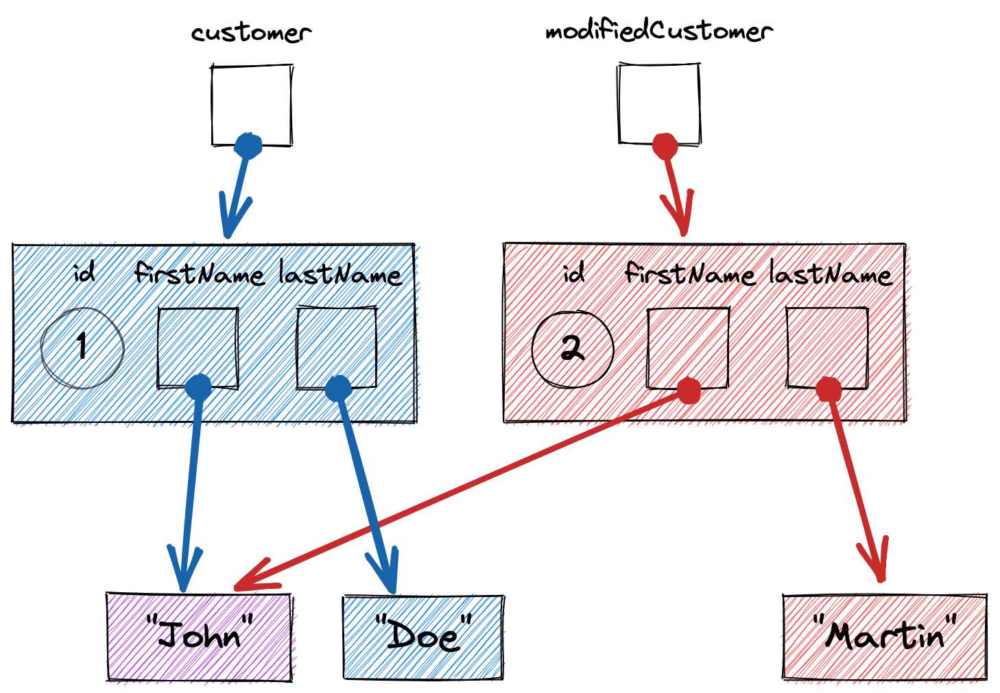

autoscale: true
footer: Practical Functional Programming - Immutability
slidenumbers: true

# Practical Functional Programming
# [fit] **Immutability**
## in Scala

---

# Why the Scala Language?

* Combines **object-oriented** and **functional** programming
* Compiles to and runs on the **JVM**
* Created by **Martin Odersky** at **EPFL**
* First release in **2004**
* **Scala 3** has outstanding support for functional programming
  - Concise, straightforward, streamlined

---

# What Is Functional Programming?

---

# Functions

* Functional Programming is programming with **functions**
* A _function_ must be
  - **Deterministic**: same arguments implies same result
  - **Total**: result always available for arguments, no exception
  - **Pure**: no side-effects, only effect is computing result

---

# Values

* A **function** manipulates values
  - Consumes values as **arguments**
  - Produces a value as a **result**
* **Values** are immutable instances of
  - Primitive types
  - Immutable classes
* _Functions_ and _values_ are two sides of the same coin

---

# Immutable Classes

---

# Immutable Class

* **Constructor** returns a new object
* **Methods** do not modify the object but return a **new object** with the modifications applied instead
* For an immutable class, Scala generates
  - a constructor to create instance :thumbsup:
  - a `copy` method to modify instances :thumbsup:

---

# Declaring an Immutable Class

```scala
case class Customer(
                     id: Int,
                     firstName: String,
                     lastName: String
                   )
```

---

# Creating an Instance

```scala
val customer = Customer(id = 1, firstName = "John", lastName = "Doe")
// 1 passed as argument to the `id` parameter
// "John" passed to `firstName` parameter
// "Doe" passed to `lastName` parameter

val name = customer.firstName
```

---

# Modifying an Instance

```scala
// One attribute modified
val modifiedCustomer = customer.copy(lastName = "Martin")

// Multiple attributes modified
val modifiedCustomer = customer.copy(firstName = "Paul", lastName = "Martin")

```

* Returns a **new instance** that is modified
* Previous instance remains unchanged

---



---

# Calculating an Attribute from Other Attributes

```scala
case class Customer(id: Int, firstName: String, lastName: String) {
  def fullName: String = s"$firstName $lastName"
}
```

* From the outside, calculated attribute looks exactly the same as other attributes :thumbsup:
* **Uniform access principle**

---

# Reminder on Comparing

* By **value**, comparing **attributes** of object
* By **reference**, comparing **object identity** (pointer, address, reference...)

---

# Comparing Immutable Instances

* Immutable class implies **comparison by value**
* Scala generates consistent
    - `.equals(other)` :thumbsup:
    - `.hashCode()` :thumbsup:

---

# Comparing Immutable Instances

```scala
val customer1 = Customer(id = 1, firstName = "John", lastName = "Doe")
val customer2 = Customer(id = 1, firstName = "John", lastName = "Doe")

assert(customer1 ne customer2) // Different by reference (ne)
assert(customer1 == customer2) // Same by value (== calls equals)
assert(customer1.hashCode == customer2.hashCode)

val customer3 = Customer(id = 1, firstName = "Paul", lastName = "Martin")

assert(customer1 != customer3) // Different by value
assert(customer1.hashCode != customer3.hashCode) // Not a general property!
```

---

# Printing Immutable Instance

```scala
val customer = Customer(id = 1, firstName = "John", lastName = "Doe")

println(customer)
 ```

Will output something like

```
Customer(1,John,Doe)
```

Scala generates useful `.toString()` automatically :thumbsup:

---

# Immutable Collections

---

# Immutable Collections

* A method that transforms an immutable collection
  - always return a **new collection** with the transformation applied
  - and keep the **original collection unchanged**
* Immutable collections **compare by value**
  - Scala implements `.equals(other)` and `.hashCode()` consistently :thumbsup:
* Immutable collections are special efficient data structures called **persistent data structures**

---

# Scala Immutable Collections

| Mutable (Java) | Immutable (Scala ) |
|----------------|--------------------|
| `Collection`   | `Seq`              |
| `List`         | `IndexedSeq`       |
| `Set`          | `Set`              |
| `Map`          | `Map`              |

Can be converted from and to Java

---

# Immutable Sequence

```scala
val ids: Seq[Int] = Seq(1, 2, 3, 4, 5)

val availableIds: Seq[String] =
  (0 +: ids :+ 6)
    // Add 0 at head of list
    // Add 6 as last element of list
    .filter(i => i % 2 == 0) // Keep only even numbers
    .map(i => "#" + i) // Transform to rank
```

`availableIds` will print as

```
List(#0, #2, #4, #6)
```

---

# Immutable Set

```scala
val greetings: Set[String] = Set("hello", "goodbye")

val availableGreetings =
  greetings ++ Set("hi", "bye", "hello") // Add more greetings
```

`availableGreetings` will print as

```
Set(hello, goodbye, hi, bye)
```
 
---

# Immutable Map

```scala
val idToName: Map[Int, String] = Map(
  1 -> "Peter",
  2 -> "John",
  3 -> "Mary",
  4 -> "Kate"
)

val updatedIdToName: Map[Int, String] = idToName
        .removed(1) // Remove entry with key 1
        .updated(5, "Bart") // Add entry
        .map((k, v) => (k, v.toUpperCase.nn)) // Value to upper case
```

`updatedIdToName` will print as

```
Map(2 -> JOHN, 3 -> MARY, 4 -> KATE, 5 -> BART)
```

---

# Immutable Option

---

# Option Type

* `Option[T]` is a generic type that models
  - the **presence** of a value of type `T`
  - or its **absence**.
* Options **compare by value** :thumbsup:

___

# Present Value (`Some`)

```scala
val maybeTitle: Option[String] = Some("Mister")

val displayedTitle: String = maybeTitle
        .map(_.toUpperCase.nn) // Transform value, as present
        .getOrElse("<No Title>") // Get value, as present
```

`displayedTitle` will print as

```
MISTER
```

---

# Absent Value (`None`)

```scala
val maybeTitle: Option[String] = None

val displayedTitle: String = maybeTitle
        .map(_.toUpperCase.nn) // Does nothing, as absent
        .getOrElse("<No Title>") // Returns default value, as absent
```

`displayedTitle` will print as

```
<No Title>
```

---

# Combining Values with Expressions

---

# Immutability of Variables

* Immutability of **objects**
  - Cannot mutate the fields of the object or collection
* Immutability of **variables** (local variable, parameter, field)
  - Cannot change the value (or reference) contained in the variable
  - `val` vs. `var` (`final` vs. ~~`final`~~ in Java)
  - **Parameters** are always `val`s in Scala :thumbsup:
    - **Local variables** and **fields** should always be `val`s in strict functional programming :thumbsup:

---

# Expressions

* A **value** is immutable by definition
* An **expression** is a _formula_ that combines values together to form another value
* Scala is an _expression based language_
  - `if`, `match`, `try` (and even `for`) are expressions
  - `{` ... `}` blocks are expressions
  - Lambdas always expect an expression after `=>`
  - `def`s always expect an expression after `=`
  - `return` is considered as evil :imp:

---

# `if` Expression

```scala
val status = if enabled then "On" else "Off"
```

```scala
val mood =
  if 1 <= mark && mark <= 3 then "Bad"
  else if mark == 4 then "OK"
  else if 5 <= mark && mark <= 7 then "Good"
  else ??? // Should never happen, fails
```

---

# `match` Expression

```scala
val mark = color match {
  case Red => 2
  case Orange => 4
  case Green => 6
}
```
---

# Block Expression

```scala
val altitude = {
  val y = slope * t

  if y < -threshold then -threshold
  else if y > threshold then threshold
  else y
}
```

Block evaluates to the last expression in the block

---

# Immutable<br>from Classes to Collections

---
# `Customer` with an Optional Title

```scala
case class Customer(
                     id: Int,
                     title: Option[String],
                     firstName: String,
                     lastName: String
                   )
```

---

# [fit] Creating and Modifying a `Customer` with Optional Title

```scala
val titledCustomer = Customer(
  id = 1,
  title = Some("Mr"), // with a title
  firstName = "Paul",
  lastName = "Smith"
)

val untitledCustomer = Customer(
  id = 2,
  title = None, // without a title
  firstName = "John",
  lastName = "Doe"
)

val modifiedCustomer = titledCustomer.copy(title = None)
```

---

# `TodoList` class

```scala
case class TodoList(
                     name: String, 
                     todos: IndexedSeq[Todo] = IndexedSeq.empty
                   ) {
  // ...
}
```

---

# `Todo` class

```scala
case class Todo(id: Int, name: String, done: Boolean = false) {
  def markAsDone: Todo =
    this.copy(done = true)
}
```

---

# Adding a `Todo`

```scala
case class TodoList(name: String, todos: IndexedSeq[Todo] = IndexedSeq.empty) {
  // ...
  def addTodo(todo: Todo): TodoList = {
    val modifiedTodos = this.todos :+ todo
    this.copy(todos = modifiedTodos)
  }
  // ...
}
```

---

# Removing a `Todo`

```scala
case class TodoList(name: String, todos: IndexedSeq[Todo] = IndexedSeq.empty) {
  // ...
  def removeTodo(todoId: Int): TodoList = {
    val todoIndex = this.todos.indexWhere(_.id == todoId)

    if (todoIndex >= 0) {
      val modifiedTodos = this.todos.patch(todoIndex, IndexedSeq.empty, 1)
      this.copy(todos = modifiedTodos)
    } else this
  }
  // ...
}
```

---

# Marking `Todo` as Done

```scala
case class TodoList(name: String, todos: IndexedSeq[Todo] = IndexedSeq.empty) {
  // ...
  def markTodoAsDone(todoId: Int): TodoList = {
    val todoIndex = this.todos.indexWhere(_.id == todoId)

    if (todoIndex >= 0) {
      val todo = this.todos(todoIndex)
      val modifiedTodo = todo.markAsDone
      val modifiedTodos = this.todos.updated(todoIndex, modifiedTodo)
      this.copy(todos = modifiedTodos)
    } else this
  }
}
```

---

# Counting Pending and Done `Todo`s

```scala
case class TodoList(name: String, todos: IndexedSeq[Todo] = IndexedSeq.empty) {
  def doneCount: Int = this.todos.count(_.done)
  def pendingCount: Int = this.todos.count(!_.done)
  // ...
}
```

---

# Creating and Manipulating `TodoList`

```scala
val todoList = TodoList("Food")
        .addTodo(Todo(1, "Leek"))
        .addTodo(Todo(2, "Turnip"))
        .addTodo(Todo(3, "Cabbage"))

val modifiedTodoList = todoList
        .markTodoAsDone(3)
        .removeTodo(2)

val doneCount = modifiedTodoList.doneCount
```

---

# Enumerations on Steroids

---
# `Direction` enumeration

```scala
enum Direction {
  case North
  case South
  case West
  case East
}
```

OK, seen that before.

---

# `Position` class

```scala
case class Position(x: Int, y: Int) {
  def move(direction: Direction): Position =
    direction match {
      case North => this.copy(y = this.y - 1)
      case South => this.copy(y = this.y + 1)
      case West => this.copy(x = this.x - 1)
      case East => this.copy(x = this.x + 1)
    }
}
```

---

# `Action` enumeration

```scala
enum Action {
  case Sleep
  case Walk(direction: Direction)
  case Jump(position: Position)
}
```

Some alternatives can have fields :astonished:

---

# Sequence of `Actions`

```scala
val actions: Seq[Action] = Seq(
  Jump(Position(5, 8)),
  Walk(North),
  Sleep,
  Walk(East)
)
```
---

# Performing an `Action`

```scala
case class Player(position: Position) {
  def act(action: Action): Player =
    action match {
      case Sleep => this
      case Walk(direction) => Player(position.move(direction))
      case Jump(position) => Player(position)
    }
}
```

---

# Performing Successive `Action`s

```scala
val initialPlayer = Player(Position(1, 1))
val playerActions = Seq(Jump(Position(5, 8)), Walk(North), Sleep, Walk(East))

val finalPlayer =
  playerActions.foldLeft(initialPlayer)(
    (player, action) => player.act(action)
  )

val successivePlayers =
  playerActions.scanLeft(initialPlayer)(
    (player, action) => player.act(action)
  )
```

* `finalPlayer` will print as `Player(Position(6,7))`
* `successivePlayers` will print as `List(Player(Position(1,1)), Player(Position(5,8)), Player(Position(5,7)), Player(Position(5,7)), Player(Position(6,7)))`

---

# Algebraic Data Type

* **ADT** in short
* Also known as _discriminated union_
* Somehow, **`enum` on steroids**
  - Some alternatives might hold one or more **attributes**
  - Attributes may vary in number and in type from one alternative to another

---

# Pattern Matching

---

# Pattern Matching with `match`

* `match` is an **expression**
* Many ways to **match a value**
* Might **extract one or more values**
* First match wins and gives the value of the expression

---

# Matching by Value and by Condition

```scala
val label = number match {
  case 0 => "Zero"
  case n if n < 0 => "Negative"
  case 19 | 23 | 29 => "Chosen primes"
  case n if n % 2 == 0 => s"Even ($n)"
  case n => s"Odd ($n)"
}
```

---

# Matching by Pattern

```scala
val label = maybeNumber match {
  case Some(0) => "Zero"
  case Some(n) if n < 0 => s"Negative ($n)"
  case Some(n) if n > 0 => s"Positive ($n)"
  case None => "Absent"
}
```

---

# Matching by Pattern on `case class`

```scala
case class Point(x: Int, y: Int)

val label = point match {
  case Point(0, 0) => "Center"
  case Point(x, 0) => "First axis"
  case Point(0, y) => "Second axis"
  case Point(x, y) if x == y => "First diagonal"
  case Point(x, y) if x == -y => "Second diagonal"
  case p => "Other"
}
```

---

# Matching by Pattern on `enum`

```scala
enum Operation {
  case Credit(account: Int, amount: Double)
  case Debit(account: Int, amount: Double)
  case Transfer(sourceAccount: Int, targetAccount: Int, amount: Double)
}

case class Bank(accounts: Map[Int, Double]) {
  def process(operation: Operation): Bank = {
    operation match {
      case Credit(account, amount) => ???
      case Debit(account, amount) => ???
      case Transfer(sourceAccount, destinationAccount, amount) => ???
    }
  }
}
```

---

# Toward Functional Design

---

# Functional Design

* **Model data** using
  - Immutable **primitive types** (`Int`, `Double`, `Boolean`...)
  - Immutable **objects** (`case class`)
  - Immutable **collections** (`Seq`, `IndexedSeq`, `Map`, `Set`)
  - Immutable **options** (`Option`)
  - Immutable **enumerations** aka _ADT_ (`enum`)
* **Compute data** using
  - _Deterministic_, _total_ and _pure_ **functions**
  - **Expressions** and **pattern matching**
