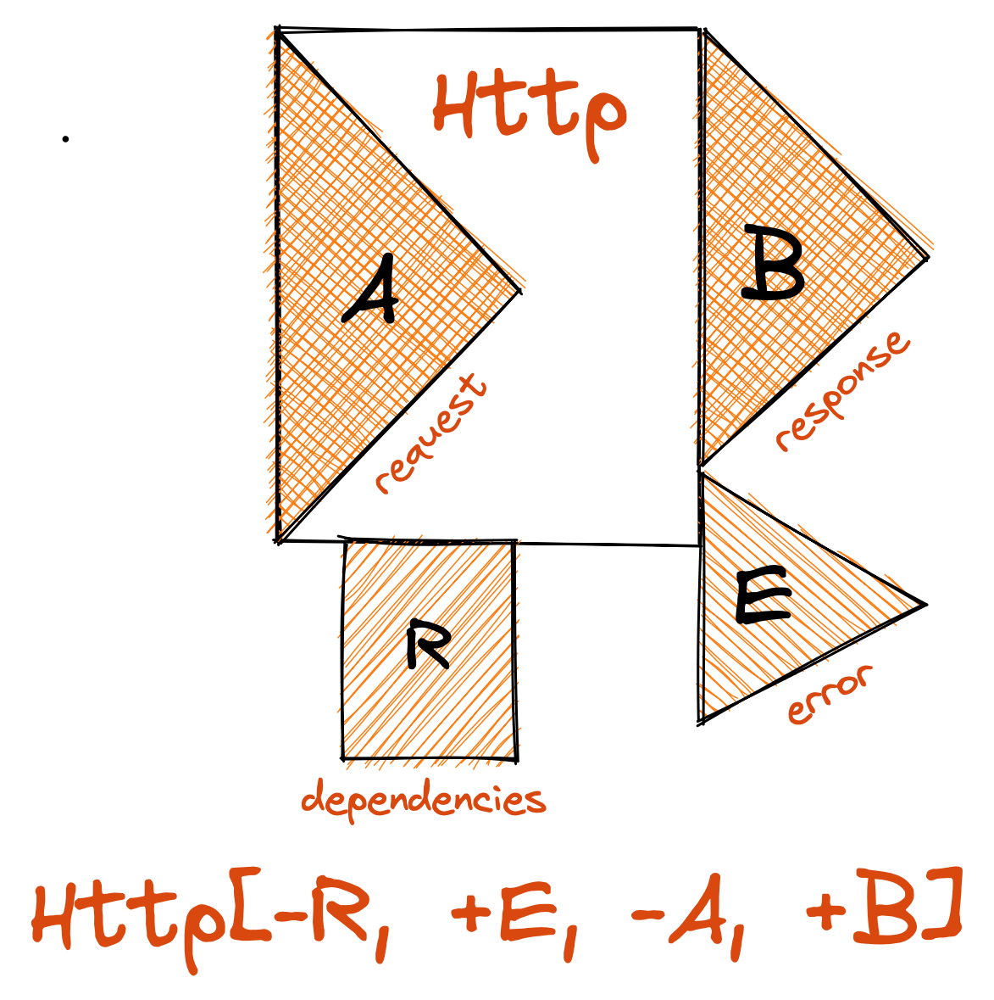
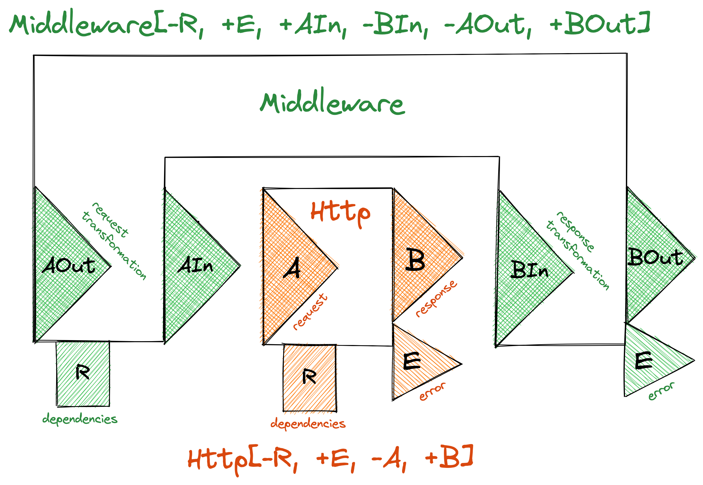

autoscale: true
footer: Practical Functional Programming - Values
slidenumbers: true

# [fit] Practical Functional Programming
# [fit] **It's All about Values**
## in Scala 3

---

# **Functional Programming**
### From the **Small** to the **Large**

---

# **Functions**

* Functional Programming is programming with **functions**
* A _function_ must be
  - **Deterministic**: same arguments implies same result
  - **Total**: result always available for arguments, no exception :wink:
  - **Pure**: no side effects, only effect is computing result
* Enough for functional programming **in the small**

---

# **Values**

* A **function** manipulates values
  - Consumes values as **arguments**
  - Produces a value as a **result**
* **Values** are **immutable** and **pure** instances of
  - Primitive types
  - Immutable classes
  - **Function** types
* Values are **compared by value** :wink: (except functions, it's undecidable :astonished:)

---

# **Expressions**

* **Expressions** combine multiple _values_ to compute another value
* _Functions_ can participate in expressions (as they are values)

---

# It’s All about **Values** and **Expressions**

* Functional Programming is programming with **values** and **expressions**
* _Functions_ are just a special kind of value
* _Applying a function_ is just a special case of expression
* Expands horizon to functional programming **in the large**

---

# **Foundations** for Values

---

# **Immutable Class**

```scala
case class Customer(id: Int, firstName: String, lastName: String)

// Create an new instance
val customer = Customer(id = 1, firstName = "John", lastName = "Doe")
val name = customer.firstName

// Create a modified copy of an instance
val modifiedCustomer = customer.copy(lastName = "Martin")
// `customer` remains unmodified

// Compare instances by value
val sameCustomer = Customer(id = 1, firstName = "John", lastName = "Doe")
assert(customer == sameCustomer)
```

---

# **Immutable Collection**

```scala
// Create a new instance
val greetings: Set[String] = Set("hello", "goodbye")

// Creating an instance by applying a method on an instance  
val availableGreetings =
  greetings ++ Set("hi", "bye", "hello")
// `greetings` remains unmodified
```

---

# **Expressions**

```scala
val status = if enabled then "On" else "Off" // `if` expression

val mark = color match { // `match` expression
  case Red => 2
  case Orange => 4
  case Green => 6
}

val altitude = { // { ... } expression
  val y = slope * t

  if y < -threshold then -threshold
  else if y > threshold then threshold
  else y
}
```

---

# **Immutable `enum`** (simple)

```scala
enum Direction {
  case North, South, West, East
}

case class Position(x: Int, y: Int) {
  def move(direction: Direction): Position =
    direction match {
      case North => this.copy(y = this.y - 1)
      case South => this.copy(y = this.y + 1)
      case West => this.copy(x = this.x - 1)
      case East => this.copy(x = this.x + 1)
    }
}
```

---

# **Immutable `enum`** (fields may vary)

```scala
enum Action { // ADT (Algebraic Data Type)
  case Sleep
  case Walk(direction: Direction)
  case Jump(position: Position)
}

case class Player(position: Position) {
  def act(action: Action): Player =
    action match { // Pattern Matching
      case Sleep => this
      case Walk(direction) => Player(position.move(direction))
      case Jump(position) => Player(position)
    }
}
```

---

# Modeling with Value Types

* Model data as **value types** with **ADT**s (Algebraic Data Types)
  - Aggregation (... with ... with ...) of fields with `case class`
  - Alternatives (... or ... or ...) with `enum`
* Add **factory** and **combinator** methods
* Use **pattern matching** with `match` expression to handle `case`s
* Mostly do not use _inheritance_ and _polymorphism_

---

# Modeling Bank `Operation`

```scala
enum Operation {
  case Credit(account: Int, amount: Double)
  case Debit(account: Int, amount: Double)
  case Transfer(sourceAccount: Int, destinationAccount: Int, amount: Double)
}
```

---

# Modeling `Bank`

```scala
case class Bank(name: String, accounts: Map[Int, Double]) {
  // ...
}
```

---

# Processing `Operation`

```scala
case class Bank(name: String, accounts: Map[Int, Double]) {
  def process(operation: Operation): Bank =
    operation match {
      case Credit(account, amount) =>
        val updatedAccounts = this.accounts.updatedWith(account, _ + amount)
        // `_ + amount` is equivalent to `a => a + amount`
        this.copy(accounts = updatedAccounts)

      case Debit(account, amount) => ???
      case Transfer(sourceAccount, destinationAccount, amount) => ???
    }
}

```

---

# **Reifying** :astonished:

*  Just one small piece of functional lingo
* **To reify**: to turn into a **value type**
* _Reification_, _reified_...
* The key to functional programming **in the large**

---

# Reifying **Fallible Results**
### Handling **Errors** in a Pure World

---

# **Fallible Result** Reified

```scala
enum Either[+E, +A] { // ...
  case Left[E](error: E) extends Either[E, Nothing]
  case Right[A](result: A) extends Either[Nothing, A]
  // ...
}

object Either {
  // --- Factories
  def succeed[A](result: A): Either[Nothing, A] = Right(result)
  def fail[E](error: E): Either[E, Nothing] = Left(error)
  // ...
}
```

---

# **Fallible Result** Reified (continued)

```scala
enum Either[+E, +A] { va => // `va` becomes an alias for `this`
  // --- Combinators
  def flatMap[E2 >: E, B](cont: A => Either[E2, B]): Either[E2, B] =
    va match {
      case Right(a) => cont(a)
      case Left(e) => Left(e)
    }

  def map[B](trans: A => B): Either[E, B] =
    va match {
      case Right(a) => Right(trans(a))
      case Left(e) => Left(e)
    }
}
```

---

# Savings Account

```scala
case class SavingsAccount(balance: Int) {
  def debit(amount: Int): Either[String, SavingsAccount] =
    if this.balance - amount >= 0 then
      Either.succeed(SavingsAccount(balance = this.balance - amount))
    else
      Either.fail("Cannot be over-debited")
    
  def credit(amount: Int): Either[String, SavingsAccount] =
    if this.balance + amount <= 500 then
      Either.succeed(SavingsAccount(balance = this.balance + amount))
    else
      Either.fail("Cannot be over-credited")
}
```

---

# Transferring Money

```scala
object SavingsAccount {
  def transfer(
                source: SavingsAccount,
                destination: SavingsAccount,
                amount: Int
              ): Either[String, (SavingsAccount, SavingsAccount)] =

    source.debit(amount) /* */ .flatMap { updatedSource =>
      destination.credit(amount) /* */ .map { updatedDestination =>
        (updatedSource, updatedDestination)
      }
    }
}
```

---

# Transferring Money (flatten them all!)

```scala
object SavingsAccount {
  def transfer(
                source: SavingsAccount,
                destination: SavingsAccount,
                amount: Int
              ): Either[String, (SavingsAccount, SavingsAccount)] =

    for {
      updatedSource <- source.debit(amount)
      updatedDestination <- destination.credit(amount)
    } yield (updatedSource, updatedDestination)
}
```

---

#  Successful Transfer

```scala
val success = SavingsAccount.transfer(
  source = SavingsAccount(200),
  destination = SavingsAccount(300),
  amount = 50
)

assert(success == Right((SavingsAccount(150), SavingsAccount(350))))
```

---

# Failed Transfers

```scala
val overDebited = SavingsAccount.transfer(
  source = SavingsAccount(40),
  destination = SavingsAccount(300),
  amount = 50
)

assert(overDebited == Left("Cannot be over-debited"))

val overCredited = SavingsAccount.transfer(
  source = SavingsAccount(200),
  destination = SavingsAccount(400),
  amount = 150
)

assert(overCredited == Left("Cannot be over-credited"))
```

---

# Reifying **Programs**
### Performing **Side-effects** in a Pure World

---

# Reifying **Infallible Programs**

---

# **Infallible Program** Reified

```scala
trait UIO[+A] {
  // --- Combinators
  def flatMap[B](cont: A => UIO[B]): UIO[B] = Op.FlatMap(this, cont)
  def map[B](trans: A => B): UIO[B] = this.flatMap(a => IO.succeed(trans(a)))
}

object UIO {
  // --- Factories
  def succeed[A](a: => A): UIO[A] = Op.Succeed(() => a)

  enum Op[+A] extends UIO[A] {
    case Succeed(result: () => A) extends Op[A]
    case FlatMap[A0, A](io: UIO[A0], cont: A0 => UIO[A]) extends Op[A]
  }
}
```

---

# Interpreting Infallible Program

```scala
object Runtime {
  // --- Interpreter
  def unsafeRun[A](io: UIO[A]): A = {
    io match {
      case Op.Succeed(result) => result(

      case Op.FlatMap(ioA0, cont) =>
        val a0 = unsafeRun(ioA0)
        val ioA = cont(a0)
        val a = unsafeRun(ioA)
        a
    }
  }
}
```

---

# Elementary `Console` Programs (infallible)

```scala
object Console {
  def printLine(o: Any): UIO[Unit] = UIO.succeed(println(o))
  val readLine: UIO[String] = UIO.succeed(StdIn.readLine())
}
```

---

# Greeting User

```scala
object ConsoleApp {
  val helloApp: IO[Unit] =
    Console.printLine("What's your name?").flatMap { _ =>
      Console.readLine.flatMap { name =>
        Console.printLine(s"Hello $name!")
      }
    }

  def main(args: Array[String]): Unit = {
    // PURE-only above ^^^^^ (program is just a value)
    Runtime.unsafeRun(helloApp) // Only this line is IMPURE!!!
  }
}
```

---

# Greeting User (flatten them all!)

```scala
object ConsoleApp {
  val helloApp: IO[Unit] =
    for {
      _ <- Console.printLine("What's your name?")
      name <- Console.readLine
      _ <- Console.printLine(s"Hello $name!")
    } yield ()

  def main(args: Array[String]): Unit = {
    Runtime.unsafeRun(helloApp)
  }
}
```

---

# Reifying **Fallible Programs**

---

# Fallible Program Exit

* **Succeed** with a **result**

* **Fail** with an **error** (value)
  - _Expected_, recoverable
  - **Domain** error, **business** error, but not only

* **Die** with a **defect** (exception)
  - _Unexpected_, not recoverable
  - Often just technical failure

---

# **Fallible Program Exit** Reified

```scala
enum Exit[+E, +A] {
  case Succeed[A](result: A) extends Exit[Nothing, A]
  case FailCause[E](cause: Cause[E]) extends Exit[E, Nothing]
}

enum Cause[+E] {
  case Fail[E](error: E) extends Cause[E]
  case Die(defect: Throwable) extends Cause[Nothing]
}
```

---

# **Fallible Program** Reified

```scala
trait IO[+E, +A] {
  // --- Combinators
  def flatMap[E2 >: E, B](cont: A => IO[E2, B]): IO[E2, B] = ???
  def map[B](trans: A => B): IO[E, B] = ???
}

object IO {
  // --- Factories
  def succeed[A](result: => A): IO[Nothing, A] = ???
  def fail[E](error: => E): IO[E, Nothing] = ???
  def die(defect: Throwable): IO[Nothing, Nothing] = ???
  
  def attempt[A](result: => A): IO[Throwable, A] = ???
}
```

---

# **Fallible Program** Reified (error handling)

```scala
trait IO[+E, +A] { // ...
  // --- Combinators
  def foldCauseIO[E2, B](
                          failCauseCase: Cause[E] => IO[E2, B],
                          succeedCase: A => IO[E2, B]
                        ): IO[E2, B] = ???

  def mapError[E2](trans: E => E2): IO[E2, A] = ???
  def orDie(using toThrowable: E <:< Throwable): IO[Nothing, A] = ???
}

extension[E <: Throwable, A] (io: IO[E, A]) {
  def refineToOrDie[E2 <: E /* ... */]: IO[E2, A] = ???
}
```

---

# Interpreting Fallible Program

```scala
object Runtime {
  // --- Interpreter
  def unsafeRun[E, A](io: IO[E, A]): Exit[E, A] = ???
}
```

---

# Elementary `Console` Programs (fallible)

```scala
object Console {
  def printLine(o: Any): IO[IOException, Unit] =
    IO.attempt(println(o))
      .refineToOrDie[IOException]

  val readLine: IO[IOException, String] =
    IO.attempt(StdIn.readLine())
      .refineToOrDie[IOException]
}
```

---

# Reading an Integer from Console

```scala
object ConsoleReader {
  def readInt: IO[IOException | String, Int] =
    for {
      s <- Console.readLine
      i <-
        IO.attempt(s.toInt)
          .refineToOrDie[NumberFormatException]
          .mapError(_ => s"Invalid integer string ($s)")
    } yield i
}
```

---

# Welcoming User

```scala
object WelcomeApp {
  case class User(name: String, age: Int)

  val program: IO[IOException | String, User] =
    for {
      name <- Console.printLine("What's your name?").flatMap(_ => Console.readLine)
      age <- Console.printLine("What's your age?").flatMap(_ => ConsoleReader.readInt)
      _ <- Console.printLine(s"You don't look like you're $age, $name.")
    } yield User(name, age)

  def main(args: Array[String]): Unit = {
    val exit: Exit[IOException | String, User] = Runtime.unsafeRun(program)
  }
}
```

---

# **Into the Large**
### with the _ZIO_ Ecosystem

---

# **_ZIO_**, a Library and an Ecosystem

* A foundation **library**
  - Fallible, side effecting **program**
  - Fallible, side effecting **stream of elements**
  - Concurrency
  - Testing
* An **ecosystem** of library based on the _ZIO_ library, including
  - **ZIO Mock**, test mocks
  - **ZIO HTTP**, HTTP server
  - **ZIO Quill**, database access
  - **ZIO Config**, **ZIO CLI**, **ZIO Logging**...

---

# Fallible Program in _ZIO_

```scala
ZIO[-R /* dependencies */, +E /* error */, +A /* result*/]
```

* Program that may
  - Succeed with a **result** of type `A`
  - Fail with an **error** of type `E`
  - Die with a **defect** (exception)
* Needed **dependencies** can be expressed as type `R`

---

# Reifying **Test Assertions**

---

# **Test Assertion** Reified

```scala
final case class Assertion[-A](/* ... */) {
  // --- Combinators
  def &&[A1 <: A](that: Assertion[A1]): Assertion[A1] = ???
  def ||[A1 <: A](that: Assertion[A1]): Assertion[A1] = ???
  def unary_! : Assertion[A] = ???
  // --- Interpreters
  def test(value: A) /* ...*/: Boolean = ???
}

object Assertion {
  // --- Factories
  def isGreaterThanEqualTo[A](reference: A)(using ord: Ordering[A]): Assertion[A] = ???
  def isLessThanEqualTo[A](reference: A)(using ord: Ordering[A]): Assertion[A] = ???
  // --- Combinators
  def isRight[A](assertion: Assertion[A]): Assertion[Either[Any, A]] = ???
}
```

---

# Combining Assertions

```scala
// --- Combinators
val assertion1: Assertion[Int] =
  Assertion.isGreaterThanEqualTo(1) && Assertion.isLessThanEqualTo(5)

val assertion2: Assertion[Either[Any, Int]] =
  Assertion.isRight(Assertion.isGreaterThanEqualTo(1))

def between[A](min: A, max: A)(using ord: Ordering[A]): Assertion[A] =
  Assertion.isGreaterThanEqualTo(min) && Assertion.isLessThanEqualTo(max)
```

---

# Checking Assertion

```scala
val assertion: Assertion[Int] = between(min = 1, max = 10)

// --- Interpreter
val result: Boolean = assertion.test(5)
```

---

# Reifying **Random Generators**

---

# **Random Generator** Reified

```scala
final case class Gen[-R, +A](/* ... */) {
  // --- Combinators
  def map[B](f: A => B): Gen[R, B] = ???
  def zip[R1 <: R, B](that: Gen[R1, B]): Gen[R1, (A, B)] = ???
  // --- Interpreters
  def runCollectN(n: Int): ZIO[R, Nothing, List[A]] = ???
}

object Gen {
  // --- Factories
  def int(min: Int, max: Int): Gen[Any, Int] = ???
  def elements[A](as: A*): Gen[Any, A] = ???
  def localDate(min: LocalDate, max: LocalDate): Gen[Any, LocalDate] = ???
}
```

---

# Combining Generators

```scala
case class Person(id: Int, firstName: String, lastName: String, birthDate: LocalDate)

// --- Factories
val idGen: Gen[Any, Int] = Gen.int(min = 1, max = 5000)
val firstNameGen: Gen[Any, String] = Gen.elements("Peter", "Paul", "Mary")
val lastNameGen: Gen[Any, String] = Gen.elements("Brown", "Jones", "Miller", "Davis")

val birthDateGen: Gen[Any, LocalDate] = Gen.localDate(
  min = LocalDate.of(1950, 1, 1).nn,
  max = LocalDate.of(1995, 12, 31).nn
)

// --- Combinators
val personGen: Gen[Any, Person] =
  idGen.zip(firstNameGen).zip(lastNameGen).zip(birthDateGen)
    .map(Person(_, _, _, _))
```

---

# Running Generator

```scala
// --- Interpreter
val generatePeople: UIO[List[Person]] = personGen.runCollectN(10)
// Running a `Generator` returns a **value** of type `UIO[A]`
```

---

# Reifying **Streams of Elements**

---

# **Stream of Elements** Reified

```scala
ZStream[-R /* dependencies */, +E /* error */, +A /* elements */]
```

* Produces 0, 1 or more **elements** of type `A` before closing
  - Potentially an infinity of elements
  - Potentially pauses between elements
  - May require **side effects** to produce the elements
* May fail at some point with an **error** of type `E`
* Expresses **dependencies** defined as type `R`

---

# Combining and Running Streams

```scala
// --- Factories
val idsStream: ZStream[Any, Nothing, Int] = ZStream.iterate(1)(_ + 1)
val firstNamesStream: ZStream[Any, Nothing, String] = ZStream("Paul", "Peter", "Mary", "John")
val lastNamesStream: ZStream[Any, Nothing, String] = ZStream("Simpson", "Davis", "Parker")

// --- Combinators
val customersStream: ZStream[Any, Nothing, Customer] =
  idsStream.zip(firstNamesStream.forever).zip(lastNamesStream.forever)
    .map(Customer(_, _, _))
    .take(6)

// --- Interpreter
val getCustomers: ZIO[Any, Nothing, Chunk[Customer]] = customersStream.runCollect
// Running a `ZStream` returns a **value** of type `ZIO[R, E, A]`
```

---

# Reifying **HTTP Server**
### with _ZIO HTTP_

---



---



---

# Reify Them All!

---

# Simple Foundations

* **Immutables classes** (`case class` and `enum`)
* **Immutable collections**
* **Expressions** and **pattern matching**
* Functions
* Advanced **type parameters** (variance, top and bottom type, subtyping, type constraints... :astonished:)

---

# Simple Patterns

* **Factories** provide basic elements
* **Combinators** assemble values to build more advanced values
* **Interpreters** can be called at last possible moment once everything is assembled
* And some interesting ways of assembling two values
  - **`flatMap`**, _dependent_ values in a _sequential_ way
  - **`zip`**, _independent_ values in a potentially _parallel_ way
